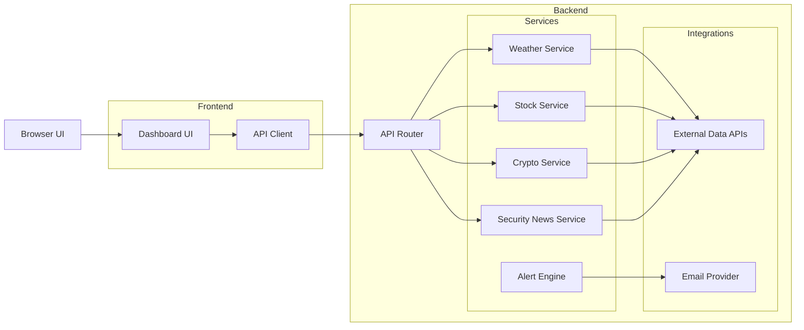

# signal-deck

A personal intelligence dashboard aggregating real-time data, alerts, and monitoring signals.

## Tech Stack

| Layer | Technology |
|---|---|
| Frontend | React 19, TypeScript, Vite |
| Backend | Python 3.13+, FastAPI |
| Package manager (BE) | [uv](https://github.com/astral-sh/uv) |
| Weather data | [Open-Meteo](https://open-meteo.com/) (free, no API key) |

## Repository Structure

```
signal-deck/
├── backend/          # FastAPI application
│   ├── main.py       # App entrypoint, middleware config
│   ├── routes/       # API route handlers (weather, ...)
│   └── services/     # Business logic & external API clients
├── frontend/         # React + TypeScript + Vite SPA
│   └── src/
│       ├── components/   # Reusable UI components
│       ├── pages/        # Page-level components
│       └── styles/       # CSS
└── infra/            # Infrastructure (Terraform / AWS)
```

## Getting Started

### Backend

Requires Python 3.13+ and [uv](https://github.com/astral-sh/uv).

```bash
cd backend
uv sync
uv run fastapi dev main.py
```

The API will be available at `http://localhost:8000`.

### Frontend

Requires Node.js 18+.

```bash
cd frontend
npm install
npm run dev
```

The dev server runs at `http://localhost:5173` and proxies API requests to the backend.

## Current Features

- **Weather dashboard** — current conditions, hourly chart, and 7-day forecast powered by Open-Meteo
  - Tabs: temperature, precipitation, wind
  - Day selection for hourly breakdown

## Planned Features

- Stocks & crypto price feeds
- Security news aggregation
- Alert engine with email notifications
- User preferences & data persistence

## Architecture Diagram



## Data Sources

| Source | Endpoint | Notes |
|---|---|---|
| Open-Meteo | `GET /weather/data?location=<city>` | 10k calls/day free tier |

### Open-Meteo rate limits
- 600 calls/min · 5,000 calls/hour · 10,000 calls/day · 300,000 calls/month
- Current conditions reflect the last 15-minute aggregate.

## Security Auditing

**Python dependencies** — checks for known CVEs in installed packages:
```bash
cd backend
uvx pip-audit
```

**Python code** — static analysis for common security issues:
```bash
cd backend
uvx bandit -r . -c pyproject.toml
```

**JavaScript dependencies:**
```bash
cd frontend
npm audit
```

## License

MIT
